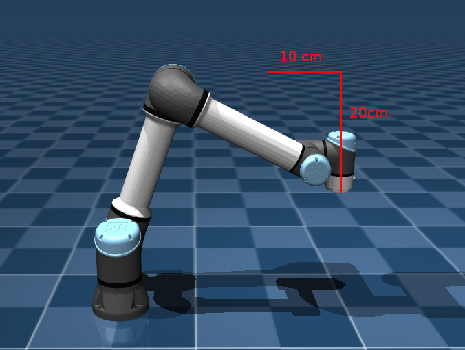
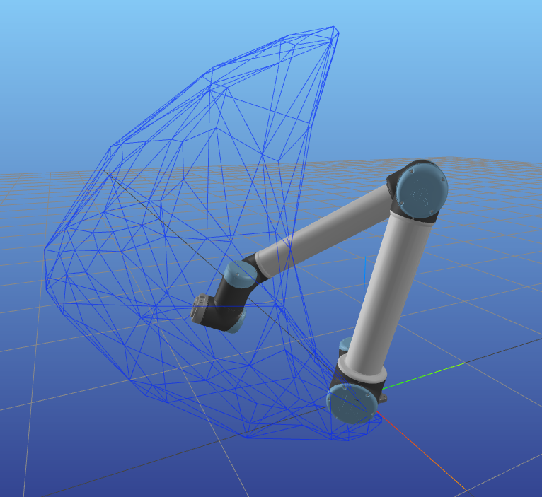
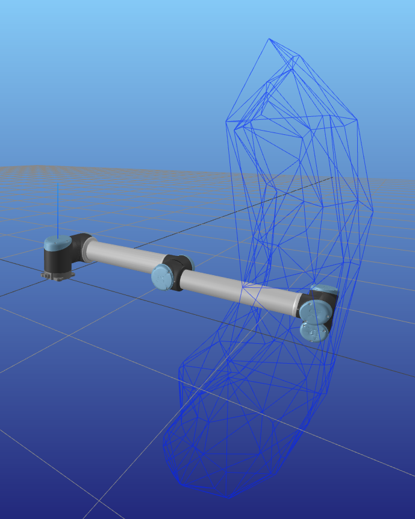
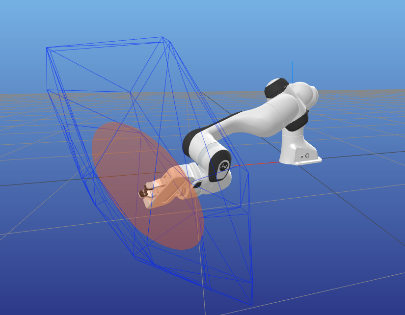
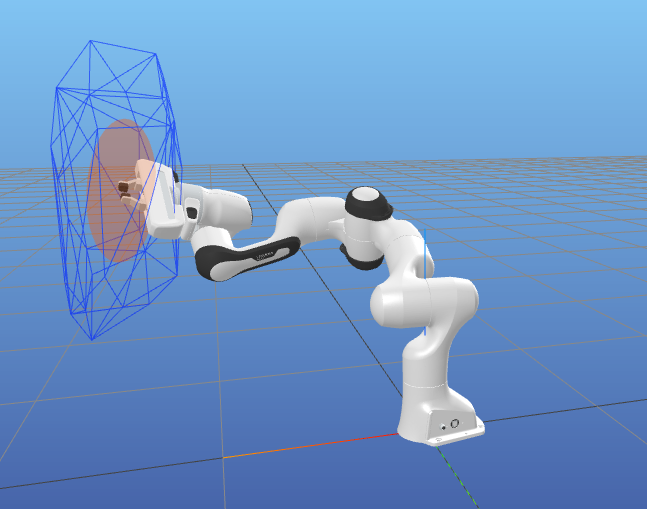

# qontrol_test

## 1-Qontrol

The first part of the test is about basic handling and understanding of the qontrol tool.

### Objective

The objective is to install qontrol and modify one example to move a robot (panda or ur5) by 0.1m along x axis.
Then by -0.2m along z axis.

### Installation

The installation went smoothly, however we could only launch the examples with the ur5 robot (simulation instable for the panda).

### Choice of the example

A set of four examples are explained in [qontrol documentation](https://auctus-team.gitlabpages.inria.fr/components/control/qontrol/md_doc_b-examples_intro.html): torque control, velocity control, custom task and custom constraint.
For the torque control and the velocity exmaples,the robot main tasks consists in following a simple trajectory defined in Cartesian space.
Thus, we arbitrarily choose to use the velocity control (velocityQontrol.cpp). 

### Working principle

The example runs using a predefined trajectory in a csv file (trajectory.csv). Each ms, the controller computes the error between the current robot pose and the trajectory pose. Then a proportionnal controller is used to defined the desired cartesian velocity to stay on the trajectory (reduce the error). Once we get the desired cartesian velocity, we solve the quadratic problem stated [here](https://auctus-team.gitlabpages.inria.fr/components/control/qontrol/md_doc_examples_velocity_qontrol.html) to compute the corresponding joints velocities. Note that a regularisation task is used to find the lowest joints velocities that achieve the goal.

### Trajectory generation

To achieve the objective, we need to modify the trajectory. Thus, we created a method "createTestTrajectory" that takes a argument the initial robot pose and from it, generates the desired trajectory in a new file "trajectory_test.csv".
For the trajectory generation, we used a classical trapezoidal velocity profile to ensure smooth movement.

We first starts with the move along x axis : 
We used as fixed parameters the maximum cartesian velocity $v_{x,max}\neq 0$ (m/s) and the acceleration $a_{x}\neq 0$ (m/s²). 

$a_{x}$ value can vary according to the phase : its value is $a_{x}$ during acceleration phase, 0 during speed cruise phase and $-a_{x}$ during deceleration phase.
The time required to reach the cruise velocity is $t1 = \frac{v_{x,max}}{a_{x}}$. It is same for the decelration duration.
We must chose $v_{x,max}$ and $a_{x}$ st $\frac{v_{x,max}^2}{a_{x}} \leq \Delta_{x}$, with $\Delta_{x}$ the desired displacement along x axis.
Then, we must compute the duration of the cruise velocity phase (t_steady). We want the integral of the cartesian velocity to be equal to $\Delta_{x}$.
Integrating our trapezoidal velocity profile we get: 

$\frac{v_{x,max}^2}{a_{x}} + t_{steady}v_{x,max} = \Delta_{x}$.

It gives $t_{steady} = \frac{\Delta_{x}}{v_{x,max}} - \frac{v_{x,max}}{a_{x}}$.

Finally, we use the following equations to compute the velocity and the position of the trajectory :

$v_{x}(t_{k+1}) = v_{x}(t_{k}) + a_{x}(t_{k})*\Delta_{T}$ where $\Delta_{T}$=1ms here.

$x(t_{k+1}) = x(t_{k}) + v_{x}(t_{k})*\Delta_{T}$ where $\Delta_{T}$=1ms here.

We replicate this method for the movement along z axis, taking into account the new x pose of the robot.

### Results

With $v_{x,max}$ = 0.05m/s, $a_{x} = 0.1m/s²$, $v_{z,max}$ = -0.05m/s and $a_{z} = -0.1m/s²$ , the robot moves smoothly and achieve follows the desired trajectory. An overview of the tajectory is displayed on the following figure (robot is at final position).

## 2-Pycapacity

### Non-convexe reachable workspace

#### Objective

The objective of this part is to display the non-convexe reachable workspace of a UR robot in two different configurations.

#### Method

First, we looked at the pycapacity documentation and more espacially a [tutorial](https://auctus-team.github.io/pycapacity/examples/reachable_workspace.html) that explains how to display the non-convexe reachable workspace of a Panda robot.

Thus, we just modified this code in "test_reachable_ws.py" to load the model of a UR10 that exists in the example_robot_data module.

We checked that the option "convex_hull" was set to False to obtain the non-convexe reachable workspace. We kept the other parameters as it. 
They allow us to calculate the faces of the polytope and to add samples to better the approximated polytope.
Increasing the number of sample better the accuracy but it increases the computation time. 

We do it for two configurations.

#### Results

The results are displayed in two windows MeshcatVisualizer. We used the default tiem horizon 200ms (if we increase it, the polytope logically expands) :

In the first configuration, the robot is folded, it has more possibilities by unfolding forward than by continuing to fold backwards

In the second configuration, the robot is almost reaching its maximal extension. 
Consequently, we see the reachable workspace doesn't extend much further than the base of the robot.
However, by rotating around the joint 0 or joint 1, the robot can travel a long distance in a short amount of time toward sides or up/down by describing a circle.

From those two examples, we can see that reachable workspace of the robot can vary a lot according to its pose.

### Force capacity polytope

#### Objective

The objective of this part is to display the force capacity polytope of a Panda robot in two different configurations.

#### Method

First, we looked at the pycapacity documentation and more espacially an [example](https://auctus-team.gitlabpages.inria.fr/people/antunskuric/pycapacity/examples/pinocchio.html) that explains how to display the force capacity polytope of Panda robot.

Thus, we  modified this code in "test_force_capacity.py" to load the model of a Panda that exists in the example_robot_data module.
However, we need the position part of the Jacobian matrix to compute the force capacity polytope. 
We used pinocchio "computeJointJacobians(robot.model,data, q)" and "getFrameJacobian(...)" to compute all the Jacobian matrices and select the desired one (ie the matrix linked to the end effector frame).

The pycapacity function "force_polytope(J,t_max,t_min)" computes the polytope from the position Jacobian, the maximal and minimal torques we get from the robot model. 

Note that we must add a translation to the polytope using Meshcat to display it at the correct place with respect to robot end effector.

The polytope being quite large, we used a scale factor (1/10) to reduce its size for vizualisation.

We do it for two configurations.

#### Results

As for the reachable workspace, we compare the results for an unfolded configuration and a folded one.

The results shows the same results : the robot cannot apply a lot of force along a certain direction when it is in an unfolded configuration.
In this case, the polytope is almost planar.
As soon as we fold it, the polytope becomes a little bit more spherical.
In this case, several joints can get involved in the force generation.